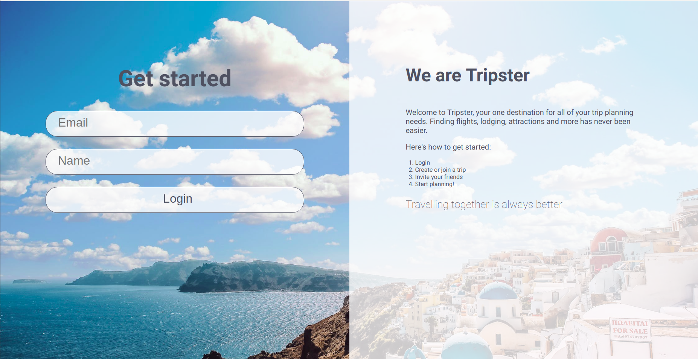
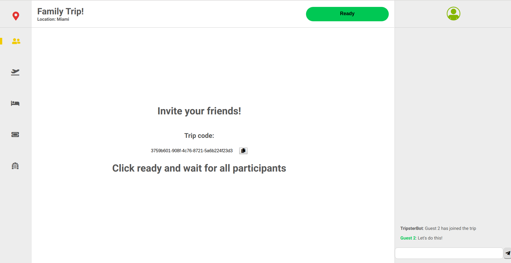
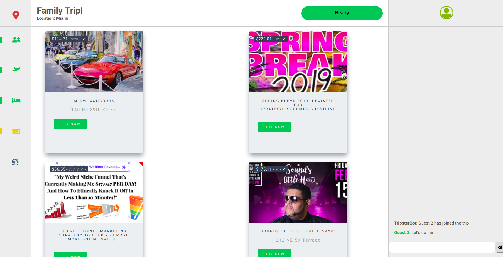
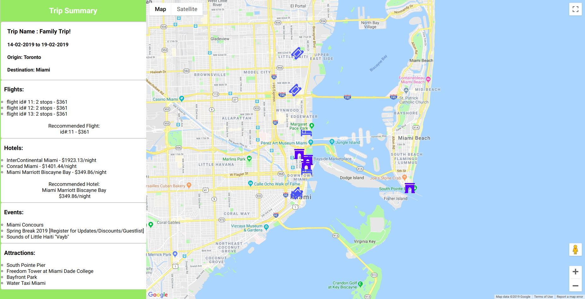

## TRIPSTER

Collaborative trip planning application built with NodeJs, Express, Socket.io, React, and PostgresSQL. 

You and your friends work together in a real-time environment to select flights, hotels, events and attractions specific to your trip details.

Data is fetched from a variety of third-party APIs, each queried using your destination and travel dates.

### Usage

1. ```git clone <new folder>```
2. In both root and server folders: ```npm i``` 
3. Create a .env in the server folder and add the following:
```
DB_HOST=localhost
DB_USER=<user>
DB_PASS=<pass>
DB_NAME=<db name>
DB_SSL=true if heroku
DB_PORT=5432
EVENTBRITE_API_TOKEN=<your key>
GOOGLE_PLACE_KEY=<your key>
GEOCODE_KEY=<your key>
```
4. Create a .env in the root folder and add the following:
```
GOOGLE_MAPS_KEY=<your key>
```
Find API keys here:
*  EVENTBRITE_API_TOKEN: [Eventbrite](https://www.eventbrite.com/platform/)
*  GOOGLE_PLACE_KEY: [Google Maps Platform](https://cloud.google.com/maps-platform/)
*  GEOCODE_KEY: [OpenCage Geocoder](https://opencagedata.com/)  
*  GOOGLE_MAPS_KEY: [Google Maps Platform](https://cloud.google.com/maps-platform/)
5. Within psql environment: ```create database <db name> owner <user>;```
6. Within server folder: ```knex migrate:latest```
7. In both root and server folders: ```npm start```
8. ```xdg-open http://localhost:3000```

### Screenshots







### Dependencies

Server:
* body-parser
* cookie-session
* cors
* dotenv
* express
* knex
* knex-logger
* moment
* nodemon
* path
* pg
* request
* socket.io
* uuid

Client:
* axios
* dotenv
* dotenv-webpack
* google-maps-react
* react
* react-dom
* react-loading
* react-router-dom
* react-router-transition
* react-ui-cards
* scripts
* socket-client
* socket.io
* universal-cookie
